# Arduino Day São Carlos 2023
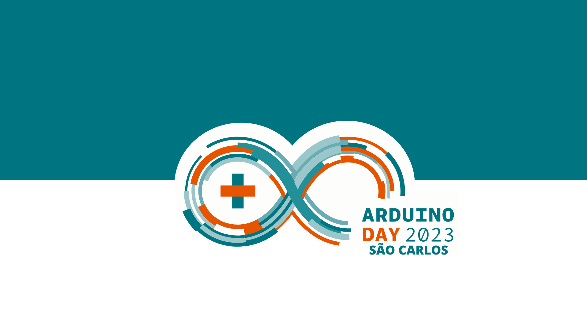

# O que é o Arduino Day
O [Arduino Day](https://day.arduino.cc/events) é uma celebração mundial de 24 horas, organizada pela comunidade para a comunidade.
É onde os interessados em Arduino se reúnem para compartilhar experiências, mostrar seus projetos e aprender mais sobre a plataforma.
A participação é aberta a todos: de makers e estudantes a profissionais da área e professores.

# Como foi o Arduino Day São Carlos 2023
O Arduino Day São Carlos 2023 foi realizado no [Departamento de Computação](https://site.dc.ufscar.br/) da [Universidade Federal de São Carlos (UFSCar)](https://www.ufscar.br/) no dia 25 de março de 2023.
A divulgação do evento foi feita através do Instagram (https://www.instagram.com/arduinodaysanca/), com 145+ seguidores.
O público estimado foi 76 participantes nos dois períodos do evento.

Clique [aqui](https://www.tavalafotografia.com.br/Postagens/Arduinoday-2023/n-JP4Gdt/) para ver todas as fotos do Arduino Day.

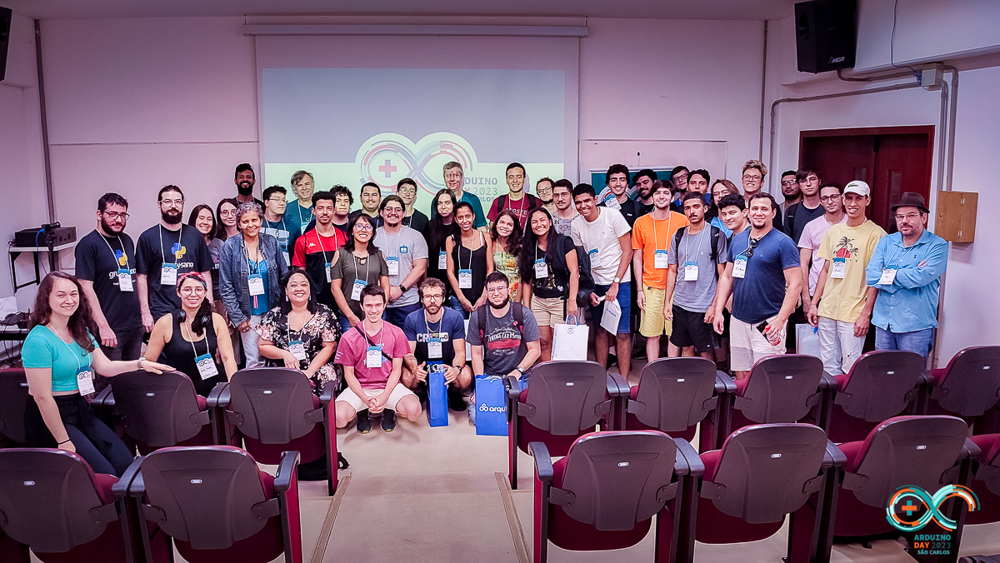

## Manhã (08h00 às 12h30)

* Minicursos

O evento começou com dois minicursos realizados durante a manhã, que tiveram 23 participantes no total.

### Introdução ao Arduino - Gedeane Kenshima
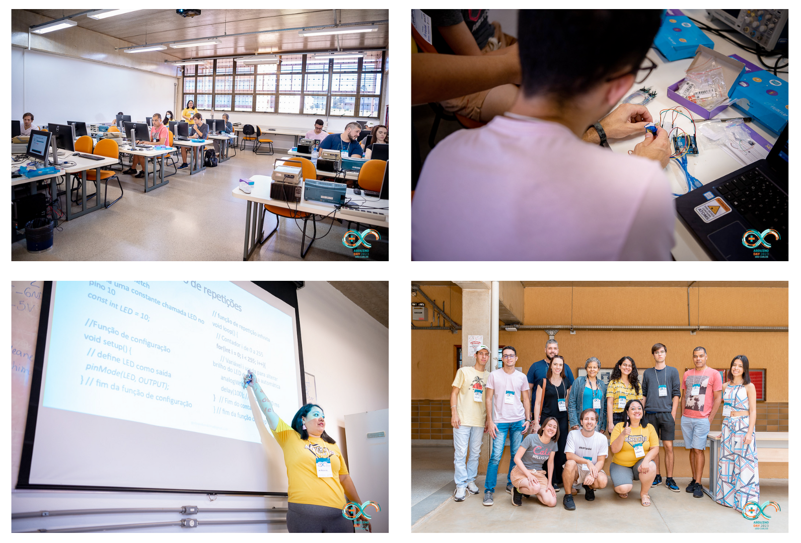

### Comunicação segura em sistemas embarcados - Mario Gazziro
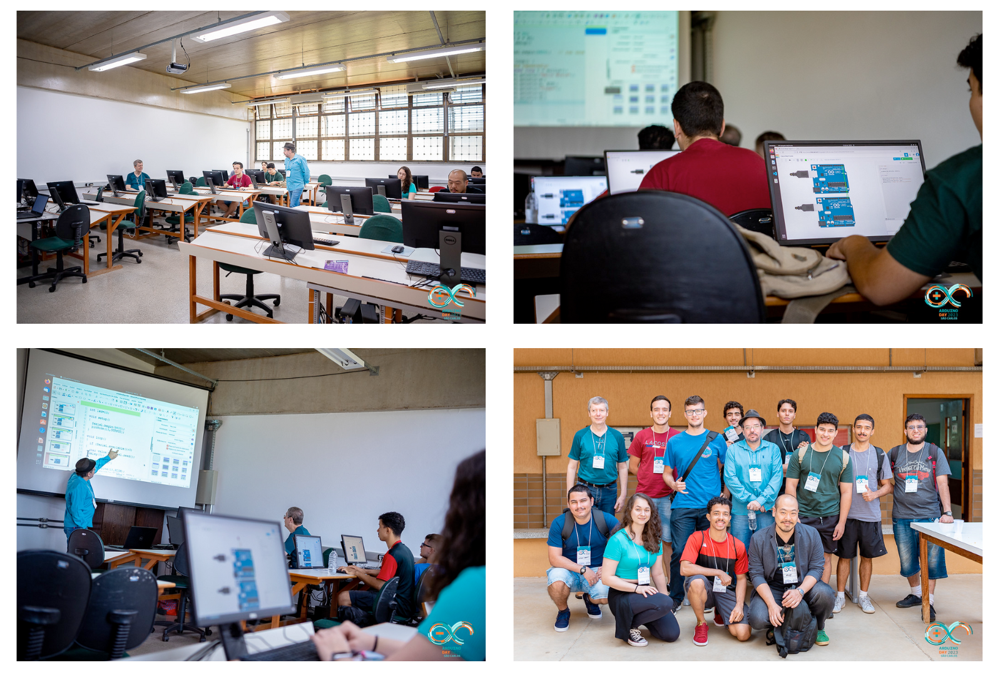

* Mostra de Projetos

A mostra de projetos aconteceu durante os minicursos e teve a exposição de dois grupos de atividades extracurriculares da UFSCar.

#### Red Dragons
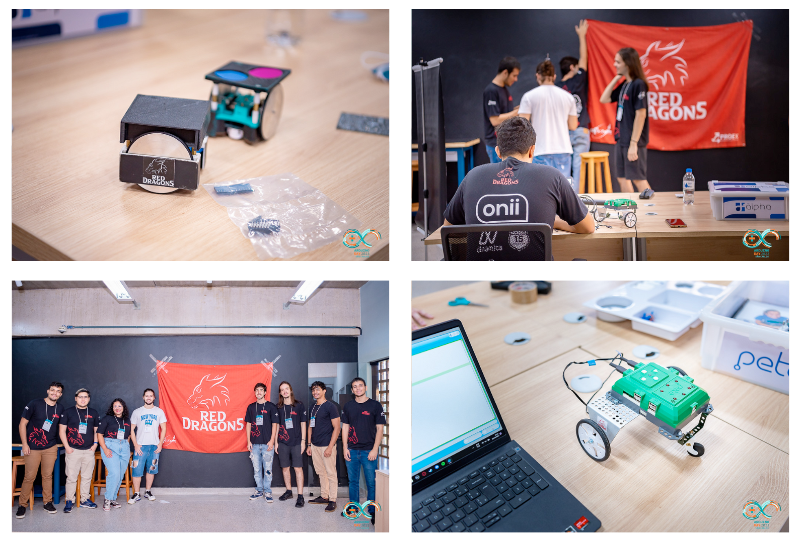

#### Baja UFSCar
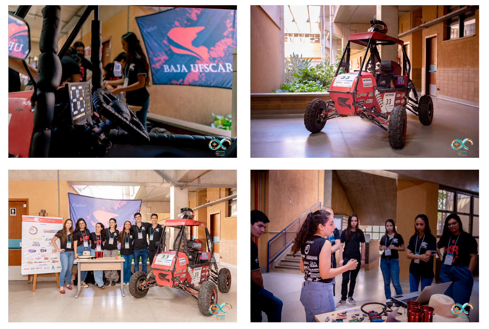

## Tarde (13h30 às 18h00)

* Palestras

No período da tarde foram realizadas quatro palestras, com público de 53 participantes.
As palestras foram transmitidas ao vivo no [canal do grupy-sanca no YouTube](https://www.youtube.com/watch?v=j5XfN4YfhW4).

### Da placa para lá e de volta outra vez: as diferenças entre publicar e disponibilizar dados dos sensores na nuvem - André Del Bianco Giuffrida
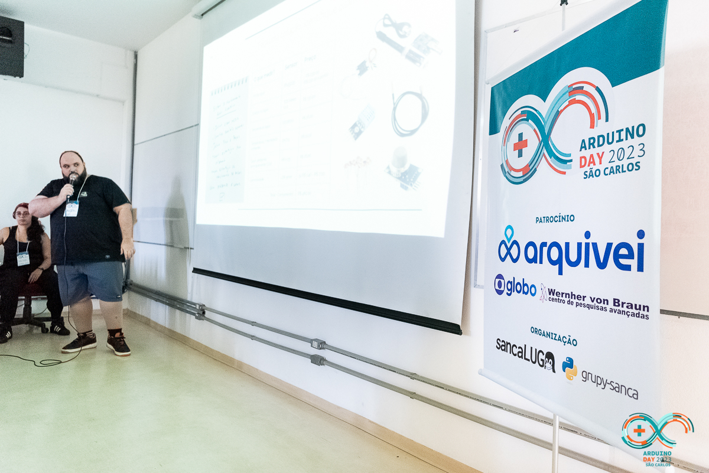

### Não use ou compre um Arduino antes de ver essa apresentação - Lucas Teske
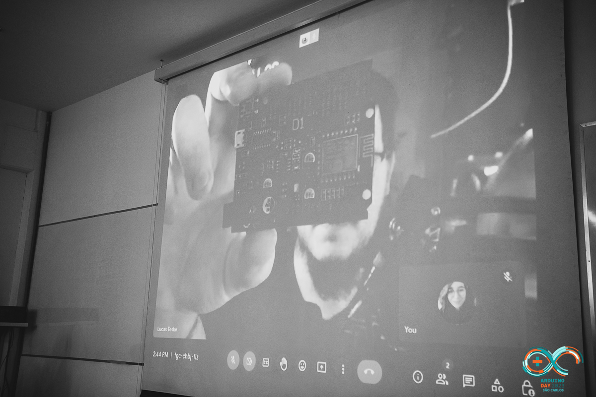

### Arduino Fashion Geek: conhecendo as possibilidades do mundo dos wearables - Gedeane Kenshima
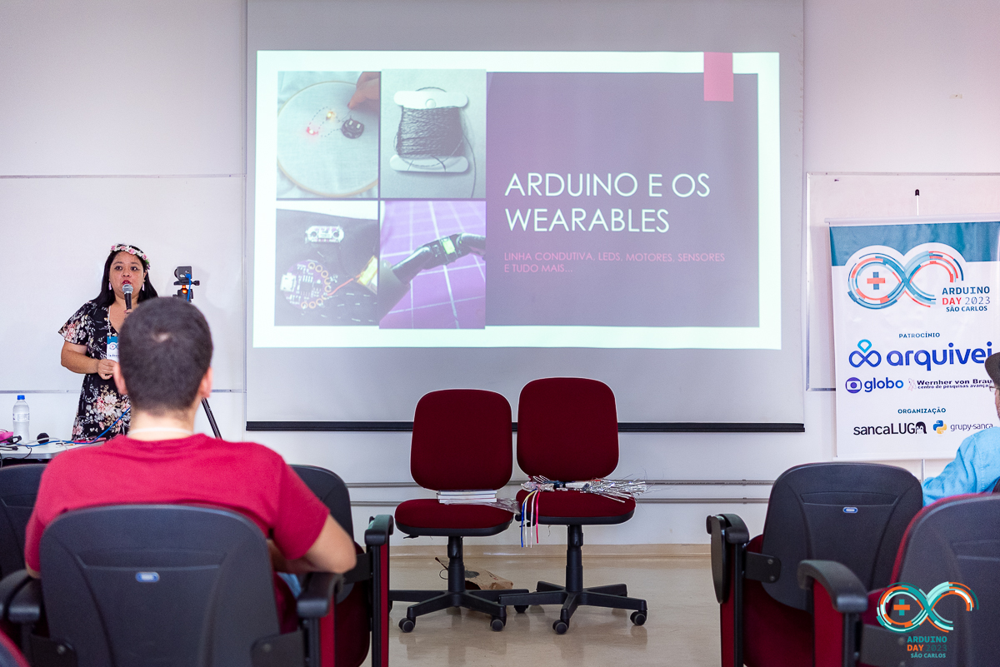

### RISC-V e sistemas embarcados - Jecel Assumpção Jr
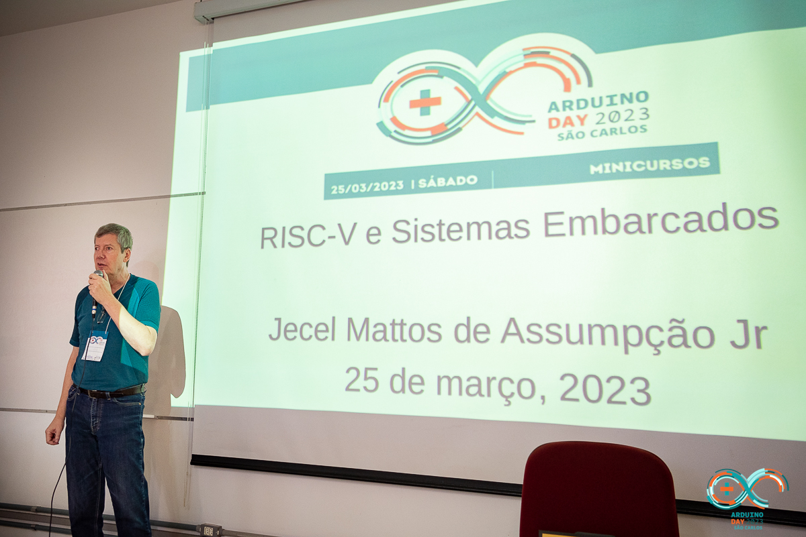

* Encerramento

Durante o encerramento, foram sorteados kits de Arduino, sendo um kit avançado, 5 kits intermediários e 5 Arduinos Nano.
A Arquivei também sorteou brindes para os participantes que preencheram o formulário no stand da empresa.

# Patrocinadores
Agradecemos ao nossos patrocinadores, que tornaram possível a realização do Arduino Day São Carlos 2023.

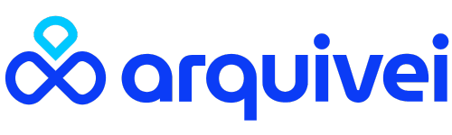

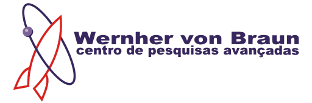

# Organização
O evento foi organizado pelas comunidade sancaLUG (Grupo de Usuários Linux de São Carlos) e grupy-sanca (Grupo de Usuários Python de São Carlos).

## sancaLUG
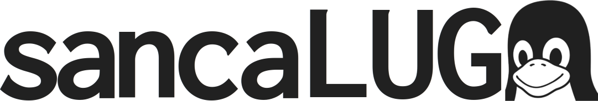
O sancaLUG é um grupo que celebra software, hardware e cultura livre em geral, na cidade de São Carlos e região. Organizamos eventos que vão de apresentações feitas por membros da comunidade, passando por festas de instalação de GNU/Linux e encontros informais.

Também fomentamos suporte e conversas em nosso grupo de mensagens. O nome sancaLUG é uma abreviação de São Carlos Linux User Group, cuja tradução é Grupo de usuários de Linux de São Carlos.

Qualquer pessoa pode fazer parte: nossa comunidade é um conjunto eclético de pessoas de todos os níveis e as áreas do conhecimento!

Telegram [https://t.me/sancaLUG](https://t.me/sancaLUG)

GitHub   [https://github.com/sancaLUG](https://github.com/sancaLUG)

Facebook [https://www.facebook.com/sancaLUG](https://www.facebook.com/sancaLUG)

## grupy-sanca
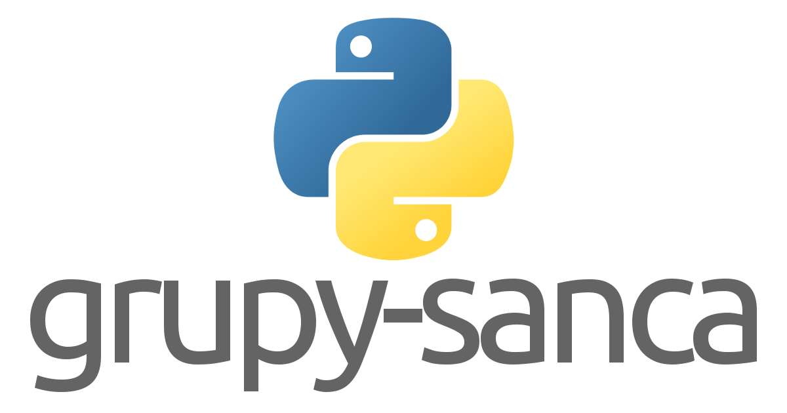
O grupy-sanca (Grupo de Usuários Python de São Carlos) é uma comunidade que reúne pessoas interessadas em desenvolvimento de software e na linguagem Python. Prezamos pela troca de conhecimento, respeito mútuo e diversidade (tanto de opinião quanto de tecnologias).

Somos um grupo da cidade de São Carlos (SP) e região. Realizamos periodicamente diversos eventos, como cursos e oficinas de programação, PyLestras, coding dojos e PyBares.

Nossas atividades são abertas à pessoas com todos os níveis de conhecimento em Python.

Telegram [https://t.me/grupysanca](https://t.me/grupysanca)

GitHub   [https://github.com/grupy-sanca](https://github.com/grupy-sanca)

Meetup   [https://www.meetup.com/pt-BR/grupy-sanca/](https://www.meetup.com/pt-BR/grupy-sanca/)

